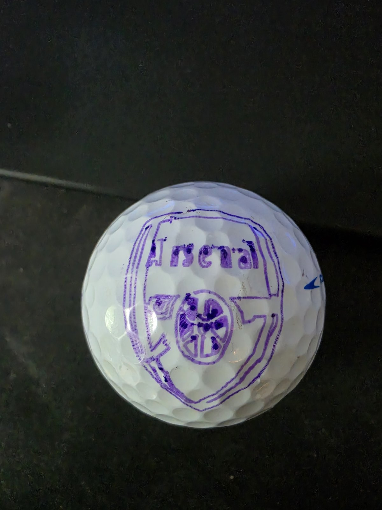
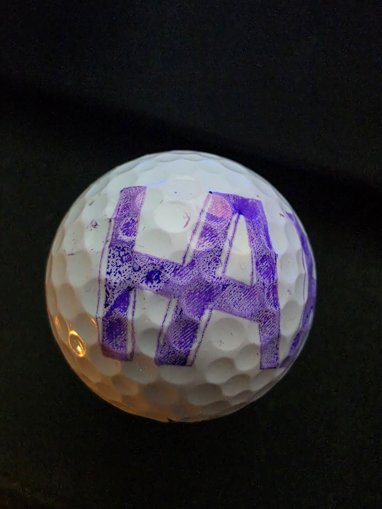
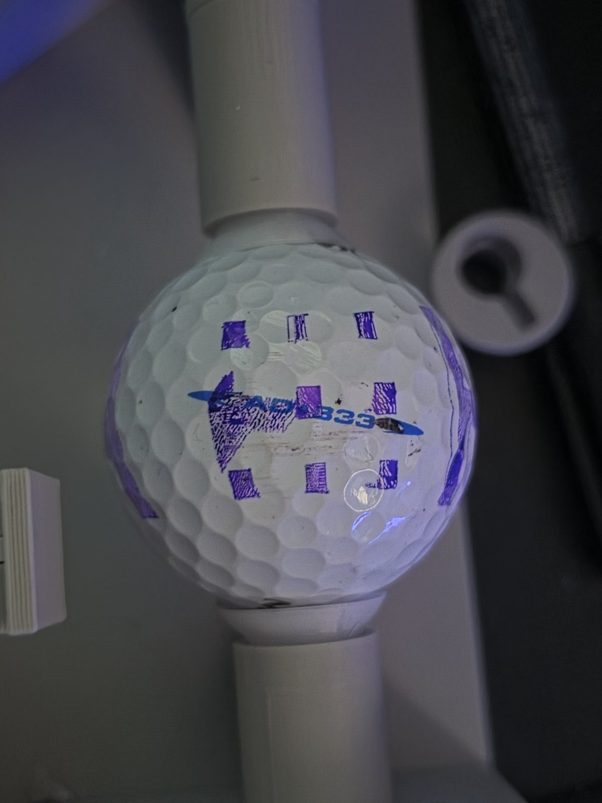
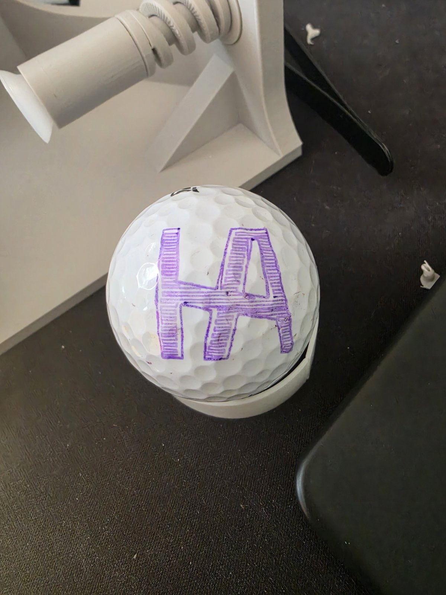
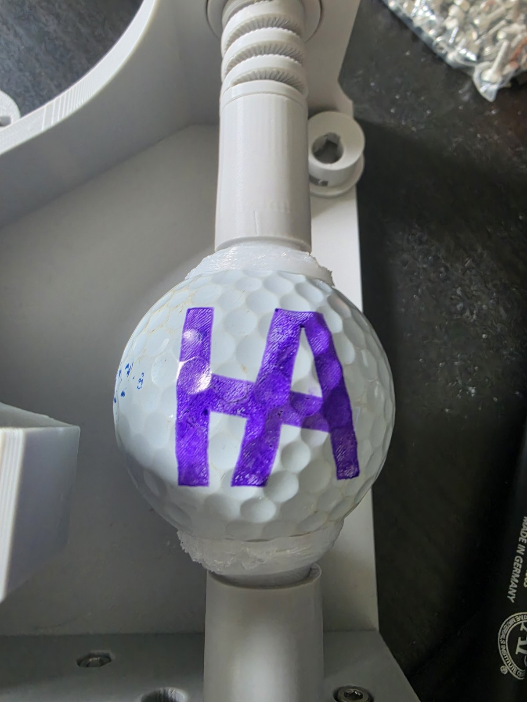
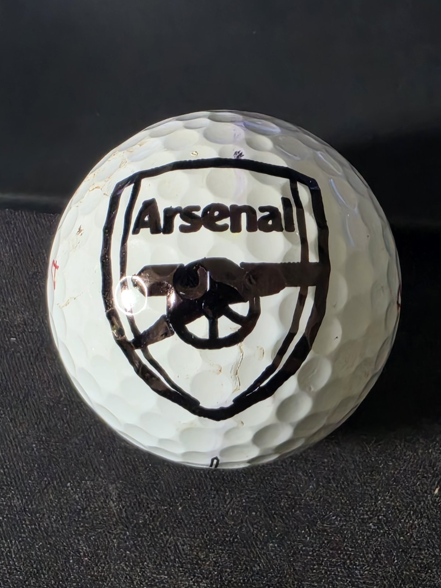
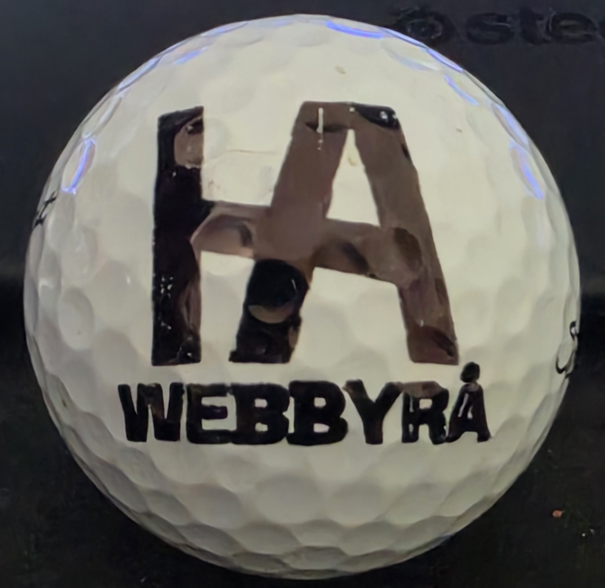

# DIY Golf Ball Plotter


A custom rotary CNC-style plotter for drawing directly onto golf balls.

This machine takes artwork, converts it into toolpaths and G-code, rotates the ball under a pen, and plots onto a curved surface using coordinated X/Y motion plus a servo pen lift. The unusual part is the kinematics: this is not a normal flat-bed plotter. X rotates the golf ball, Y rotates the pen arm, and the software has to map 2D artwork onto a printable band on a sphere.

The result is a working prototype built from scratch in CAD, 3D printed parts, GRBL-based motion control, and a custom software stack centered around a purpose-built slicer/toolpath generator.

| Field | Details |
|---|---|
| Status | Working prototype |
| Project type | Hardware + software + CNC/toolpath generation |
| Started | May 2026 |
| Controller | Arduino Uno + CNC Shield |
| Firmware | GRBL 1.1h Config B, servo-modified |
| Motion | X rotates the ball, Y rotates the pen arm, servo lifts the pen |
| Software stack | Python, Flask, React, Vite, TypeScript, custom G-code generator |
| Main challenge | Getting preview geometry, generated G-code, and real physical motion to agree on a curved surface |
| Current result | Can generate G-code, stream jobs to GRBL, and draw custom artwork directly on golf balls |

## The Idea

I had thought about making a golf ball drawing robot before, but it stayed in the category of "interesting idea" for a long time. What changed was seeing golf ball drawing robots in TikTok videos. That made the project feel concrete enough to actually start.

Those videos were useful as inspiration, but the actual documentation behind that style of robot was next to none. There was very little detail about the mechanical design, grip system, motion setup, firmware choices, or software pipeline. So even though the concept came from seeing those builds online, turning it into a real machine still meant working out most of the design and implementation myself.

Instead of copying someone else's build, I wanted to design my own version from scratch. I already had a few of the important parts at home, including NEMA 17 stepper motors, an Arduino Uno, and a CNC Shield, so the project suddenly felt realistic.

That turned it into a genuinely broad build:

- Mechanical design in Fusion 360
- 3D printing almost the entire machine
- Arduino + GRBL machine control
- Custom G-code generation
- Curved-surface geometry mapping
- Serial communication and job control
- Calibration and print-debug tooling

## What It Does

At a high level, the workflow is:

1. Import artwork as an image input.
2. Analyze the artwork and turn it into printable regions, outlines, detail traces, and infill.
3. Map that geometry into the machine's rotary coordinate system.
4. Generate GRBL-compatible G-code with pen up/down commands.
5. Preview the toolpaths locally in 2D and 3D.
6. Stream the job to the machine and draw directly on a golf ball.

The current software supports:

- Image-to-G-code plotting with color-based region selection
- Raster image analysis and color selection
- Outline and fill generation
- Slicer-style infill on a curved target
- Artwork scaling and placement
- Previewable toolpaths
- Pen up/down G-code generation
- Servo dwell and ramp behavior
- Manual multi-color workflows
- Buffered GRBL streaming
- Job lifecycle handling and machine-state tracking
- Calibration pattern generation and diagnostics

## Hardware Overview

The hardware is intentionally simple in terms of electronics, but the mechanics are custom.

- Arduino Uno
- CNC Shield
- NEMA 17 stepper motors
- Servo for pen lift
- X axis for ball rotation
- Y axis for pen-arm rotation
- Fully 3D-printed frame except for the electronics
- 3D-printed spring pressing against the ball
- Redesigned ball cups/grip mechanism

Almost everything except the electronics is 3D printed. I designed the machine from scratch in Fusion 360, and this was my first mechanically complex design project. Before this, most of my CAD work had been simpler printable parts rather than moving assemblies with alignment, loading, grip, and repeatability concerns.

The printed spring was generated with the MakerWorld printable spring configurator:

- [MakerWorld printable spring configurator](https://makerworld.com/sv/models/1742752-printable-spring-configurator#profileId-1852208)

## Firmware And Machine Control

The machine runs on a GRBL 1.1h Config B build modified for servo-based pen control.

That mattered because it let me keep motion control and pen actuation on the same controller. The servo is connected through the `Z+` endstop on the CNC Shield, which means the software can emit servo-driven pen up/down commands without needing a separate pen-lift controller.

GRBL handles the coordinated X/Y motion. The backend generates the G-code, applies the pen-lift behavior, streams commands over serial, and tracks the job as a physical machine process rather than just a file export.

## The Software Side

The software became much bigger than a simple G-code sender.

It started as local Python scripts for serial control and plotting experiments, then grew into a complete local control stack with a Flask backend, a React/Vite dashboard, preview tooling, calibration workflows, and a custom slicer/toolpath generator built specifically for this rotary machine.

### Custom G-code slicer

This is the most important software part of the project.

I built a custom slicer/toolpath generator from scratch because standard flat-bed plotting and CNC workflows do not understand this machine. A normal plotter thinks in Cartesian X/Y coordinates on a flat plane. This machine does not.

Here:

- X is ball rotation
- Y is pen-arm rotation
- The printable area is a curved band on a sphere
- The same drawing has to look correct after being projected onto that surface

That means the software has to do more than trace outlines. It has to reason about geometry before projection, then preserve that geometry once it becomes machine motion.

Current slicer and generation capabilities in the repo include:

- Raster image analysis with color quantization and mask generation
- Fill and outline generation
- Infill density and effective infill spacing controls
- Travel optimization
- Thin-detail mode
- Detail segment suppression
- Pen-down infill connectors
- Outline-after-fill logic
- Surface mapping and placement transforms
- Artwork scaling
- Toolpath cleanup and path ID tracking
- Preview/G-code consistency debugging

The implementation is spread mainly across:

- [app/services/pipeline_core.py](app/services/pipeline_core.py)
- [app/services/toolpath_service.py](app/services/toolpath_service.py)
- [app/services/geometry_service.py](app/services/geometry_service.py)
- [app/services/gcode_service.py](app/services/gcode_service.py)
- [app/services/raster_analysis_service.py](app/services/raster_analysis_service.py)

### Image workflow

The current workflow is image-based:

- The software analyzes the image into printable color regions
- Lets the operator choose exactly which colors to print
- Builds masks and printable regions from those selected colors
- Generates fills, walls, detail traces, and G-code from the selected regions

That makes black-and-white artwork especially quick to work with, because the operator can isolate the printable dark regions with very little setup. The same workflow also scales to multi-color plotting by generating one G-code job for one selected color at a time, then repeating the process for the next color.

This is where the manual multi-color workflow comes in. The current workflow is operator-driven rather than automatic:

- Select one color from the image
- Generate the G-code for that color pass
- Run that job
- Change pen manually
- Generate or run the next color pass

That is still useful in practice, but it is not an automatic multi-pen changer and I do not want the README to imply that it is. One of the practical issues I ran into is keeping calibration consistent while changing colors between passes. Right now that is one of the main blockers for cleaner multi-color results.

### Preview and dashboard

The repo includes a React/Vite frontend that acts as a local operator dashboard.

It is functional, but it is not the nicest-looking dashboard and it still needs a lot of cleanup. It does the job for local machine operation, and it will probably get a visual reskin later.

It includes:

- Local web UI for machine control
- 2D preview
- 3D ball preview
- Toolpath legend and progress highlighting
- Machine connection and calibration state
- Manual jog controls
- Pen controls
- Run, pause, resume, and stop controls
- Job summaries and logs
- Calibration pattern UI
- X-axis calibration analysis UI
- Advanced slicer and pen settings

Representative frontend files:

- [frontend/src/App.tsx](frontend/src/App.tsx)
- [frontend/src/store/appStore.ts](frontend/src/store/appStore.ts)
- [frontend/src/components/preview/PreviewWorkspace.tsx](frontend/src/components/preview/PreviewWorkspace.tsx)
- [frontend/src/components/preview/Ball3DView.tsx](frontend/src/components/preview/Ball3DView.tsx)
- [frontend/src/components/calibration/CalibrationPatternPanel.tsx](frontend/src/components/calibration/CalibrationPatternPanel.tsx)
- [frontend/src/components/calibration/XAxisCalibrationPanel.tsx](frontend/src/components/calibration/XAxisCalibrationPanel.tsx)

### GRBL streaming and job control

Because this project controls real hardware, machine state matters just as much as geometry generation.

The software does not just emit G-code. It also:

- Connects to GRBL over serial
- Buffers G-code streaming
- Tracks sent and acknowledged lines
- Handles pause and resume
- Detects timeouts and interruptions
- Returns the machine home when cleanup conditions are safe
- Preserves or clears motor-hold state based on calibration rules
- Logs job lifecycle events for debugging

The relevant backend pieces are:

- [app/services/serial_service.py](app/services/serial_service.py)
- [app/services/job_runner.py](app/services/job_runner.py)
- [app/services/machine_service.py](app/services/machine_service.py)

### Calibration and diagnostics

Calibration eventually became one of the most important software areas in the project.

The repo now includes:

- Measurable 3x3 square calibration pattern generation
- X-axis rotary calibration pattern generation
- Analysis helpers for under-travel, over-travel, slip, backlash, and eccentricity
- Alignment and projection debugging
- Preview-versus-G-code validation

That mattered because I spent a lot of time chasing what looked like slicer bugs. Better diagnostic tooling finally made it possible to separate software problems from mechanical ones.

## Development Timeline

This section mixes two kinds of information:

- Personal project context, which is not fully visible in Git
- Git-backed milestones from the software history

The timeline source used for the software summary is [docs/project-history-timeline.md](docs/project-history-timeline.md).

### 2026-05-09 - First hardware design started

Personal project context:
I started the first Fusion 360 model and prototype work around this date.

### 2026-05-13 - First software baseline

Git-backed: `bad96b3`

Initial local Python scripts appeared for serial control, local machine control, and SVG/G-code plotting.

### 2026-05-13 - Consolidation around the plotting runner

Git-backed: `8180e74`, `eb85ca5`

Dependencies were added, the repo was simplified, and the work consolidated around the main plotting workflow instead of separate helper scripts.

### 2026-05-14 - Infill density and travel optimization added

Git-backed: `8c75254`

This was the first strong sign that the software was becoming a real slicer rather than only an outline tracer.

### 2026-05-14 - Monolithic script refactored into a Flask application

Git-backed: `9b2b66a`, `4ba644d`

The project moved from one large script into routes, services, models, utilities, and tests.

### 2026-05-14 - Raster analysis and image processing added

Git-backed: `7152e43`, `17ba97f`

The software gained color analysis, mask generation, raster region extraction, and thin-detail handling.

### 2026-05-14 - Toolpath quality iteration accelerated

Git-backed: `74db638`, `5bbf9d2`, `a43901b`, `ba7e8e2`, `108c490`

This phase added zoomable previews, connector logic, pen-down infill connectors, detail suppression, and outline-after-fill behavior.

### 2026-05-14 - Buffered GRBL streaming added

Git-backed: `1583508`

GRBL communication became much more reliable with buffered line streaming and dedicated tests.

### 2026-05-15 - Surface mapping refined and React/Vite dashboard introduced

Git-backed: `d931e3d`, `d2c75ff`, `2d6aa9f`

The geometry mapping was refined and the frontend was rebuilt as a richer React/Vite operator dashboard with preview, calibration, and machine control panels.

### 2026-05-17 - Machine safety and calibration-state handling improved

Git-backed: `7880286`, `6a61e66`

The code added stepper hold policy behavior, calibration locking, Y-loop testing, and job-safety tests.

### 2026-05-18 - Alignment checks, logging, and job lifecycle reliability improved

Git-backed: `e5d7257`, `79c4cd0`, `aee933c`, `5eafef1`

This was a major debugging and hardening phase: projection checks, job logging, validation, and stronger toolpath tests.

### 2026-05-20 - Internal project context and regression tests expanded

Git-backed: `613751f`

Tests were added for GRBL line reading and toolpath consistency, and the project gained a stronger internal context document for future work.

### 2026-05-21 - Measurement-driven calibration tools added

Git-backed: `7279453`, `6fa3d13`, `258583d`

The repo gained 3x3 calibration pattern generation, X-axis rotary diagnostics, artwork scaling, and smarter infill processing.

## The Hardest Bug: When Software Was Not The Real Problem

One of the most important debugging lessons in this project came from a problem that looked like a slicer bug.

Outlines and infill did not line up properly. I spent a lot of time assuming the issue was in my own geometry and toolpath code, because that was the part I had built from scratch and was actively changing.

That assumption was misleading.

The infill was often consistent enough to make the issue look mathematical, while the outlines looked worse. That pushed me toward software fixes first:

- Toolpath adjustments
- Projection checks
- Shared printable-region validation
- Preview-versus-G-code debugging
- More calibration and analysis tooling

Eventually I made a measurable calibration print and got a clearer answer: the real problem was X-axis ball rotation slipping.

The TPU cups pressing against the ball did not create enough friction during faster outline moves. The software was not perfect, but it was not the root cause of that specific failure.

The real fix was mechanical:

- Larger cup contact area
- Inset for double-sided tape
- More grip
- More softness and compliance at the contact point

That was a valuable engineering lesson. Physical-machine debugging is dangerous when every mismatch gets blamed on software first. Sometimes the right answer is not another slicer tweak. Sometimes the machine is lying to the code.

## First Real Result

The first time the machine moved from generated G-code felt like a major milestone even though the print quality was still rough.

That moment mattered because it proved the whole chain was real:

- Artwork in
- Toolpaths generated
- G-code emitted
- GRBL streaming
- Rotary motion on the actual machine

Later, the first permanent-ink print went surprisingly well. By then I had already spent a lot of time testing preview geometry, line ordering, fill behavior, servo timing, and calibration patterns, so the result was less of a lucky first try and more of a payoff from all the earlier iteration.

The machine is still a prototype and the print quality still needs refinement, but it has already crossed the line from concept into working system.

## What I Learned

- CAD for moving assemblies is very different from modeling static printable parts.
- 3D-printed tolerances matter much more when motion and alignment are involved.
- Grip and friction can dominate print quality in rotary mechanisms.
- GRBL is a strong foundation, but the machine-control details still matter.
- Servo pen lifting needs both firmware support and software timing discipline.
- Serial communication gets more serious once physical reliability matters.
- Buffered streaming is much safer than naive line-by-line sending.
- Custom G-code generation becomes a geometry problem long before it becomes a syntax problem.
- Fill generation, outline generation, and travel planning are all tightly connected.
- Manual multi-color workflows still need good software support even without automatic hardware changes.
- Calibration-driven debugging is much better than intuition-driven debugging.
- Some of the hardest "software bugs" are actually mechanical problems.
- A real operator dashboard is different from a simple test UI because it has to expose state, safety, and diagnostics clearly.

## Current Status

This is a working prototype.

Right now the project can:

- Generate G-code from image inputs
- Control the machine through a local Flask backend
- Preview jobs in a React/Vite dashboard
- Stream buffered jobs to GRBL
- Run calibration patterns and rotary diagnostics
- Draw directly on golf balls

At the same time, some parts are still prototype-level:

- Print quality is still being improved
- Grip durability and consistency still matter a lot
- Manual multi-color changes can disturb calibration between passes
- Both the backend and frontend still need a lot of cleanup
- The frontend dashboard is functional, but not especially polished yet
- The repo does not yet include a full wiring diagram
- Firmware setup notes are still lightweight
- CAD/STL publishing is not ready yet

## Next Steps

- Improve print quality and repeatability
- Keep refining the ball grip and cup durability
- Add a physical 3D-printed Y-axis lock at `0` degrees to preserve calibration during manual color changes, separate from the existing motor-hold behavior used while calibrated
- Improve infill efficiency and path planning
- Reduce print time significantly; the Arsenal test print is around 7 minutes and I would like to get that closer to half
- Improve the UX and repeatability of the manual multi-color workflow
- Add more documentation and process photos
- Add a wiring diagram
- Add fuller firmware setup notes
- Add a practical calibration guide
- Publish CAD/STL files if and when the design is ready

For a more implementation-focused plan, see [ROADMAP.md](ROADMAP.md). That roadmap is ordered by engineering dependency and risk rather than by week-by-week scheduling.

## Tech Stack

- Python 3.11+
- Flask
- NumPy
- Shapely
- Pillow
- OpenCV
- PySerial
- `svgpathtools`
- React
- Vite
- TypeScript
- Zustand
- Three.js / React Three Fiber
- GRBL 1.1h
- Arduino Uno
- CNC Shield
- Fusion 360
- 3D printing
- G-code

## Repository Structure

```text
.
|-- app/                    Flask backend, routes, services, machine state, G-code pipeline
|-- frontend/               React/Vite/TypeScript dashboard
|-- tests/                  Backend and pipeline regression tests
|-- docs/                   Project notes, timeline, and images
|-- artifacts/              Example generated preview artifacts
|-- dev.py                  Starts backend + frontend together
|-- run.py                  Starts Flask backend only
|-- pyproject.toml          Python package metadata
|-- requirements.txt        Python dependency list
```

## Running Locally

### Backend

```bash
pip install -e .[dev]
```

Run the Flask backend only:

```bash
python run.py
```

### Frontend

Install frontend dependencies once:

```bash
cd frontend
npm install
```

Run the frontend by itself:

```bash
npm run dev
```

### Full local development

After the frontend dependencies are installed, this starts both Flask and Vite:

```bash
python dev.py
```

Expected local URLs:

- Dashboard: `http://127.0.0.1:5173`
- Backend API: `http://127.0.0.1:5000`

### Tests

```bash
pytest
```

## Safety Note

This repository controls real motors and a real pen.

- Test with the pen lifted first.
- Start with conservative feed rates.
- Keep hands clear of moving parts.
- Verify the GRBL connection and settings before running a job.
- Treat pause, stop, and homing behavior as machine actions, not just UI buttons.

## Gallery

| Stage | Image |
|---|---|
| Early rough print |  |
| Outline/infill mismatch era |  |
| Calibration-driven debugging |  |
| Mounted ball in the machine |  |
| Improved HA logo test |  |
| branded test print |  |
| HA Webbyrå logo |  |

Captions:

- Early rough outline test: one of the first visible prints after getting the basic pipeline moving.
- HA logo mismatch test: useful because the outline and infill behavior made alignment problems obvious.
- Calibration print example: part of the shift from guessing to measurement-driven debugging.
- Mounted ball test: the machine holding the ball during an HA print iteration.
- Ball being printed: a later in-process machine photo showing the pen actively drawing on the mounted ball.
- Improved HA logo test: later non-branded result showing a much more convincing fill and outline pass.
- Later branded test print: a later test print included as development documentation rather than a product example.

## Credits And Inspiration

- Inspired by golf ball drawing robot videos seen online, especially the moment they made the idea feel buildable rather than hypothetical.
- Mechanical design created from scratch in Fusion 360.
- Printed spring generated with the MakerWorld printable spring configurator:
  [MakerWorld spring configurator](https://makerworld.com/sv/models/1742752-printable-spring-configurator#profileId-1852208)

This project README describes a prototype and development process. Any branded graphics shown here are test prints or calibration artwork, not products for sale and not an indication of affiliation with any club, brand, or creator.
